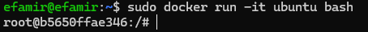
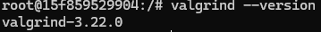
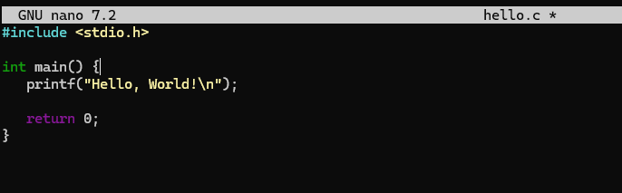
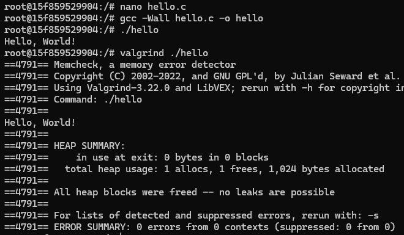
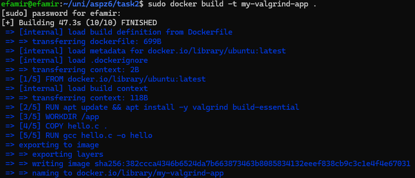
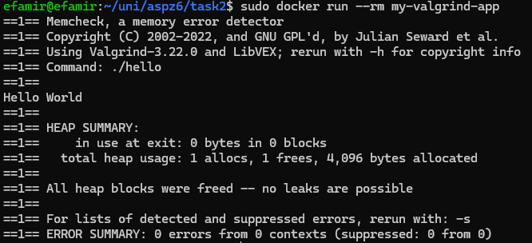
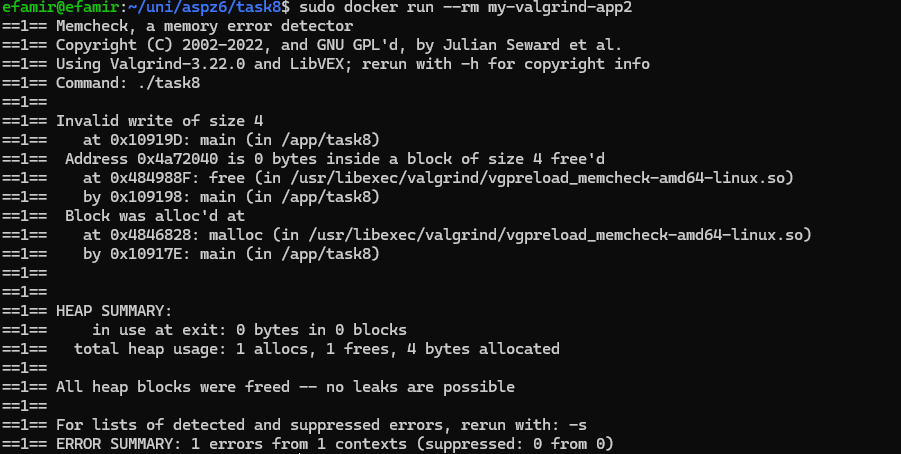

# Практична 5
### Виконав студент групи ТВ-33 Козінченко Тимофій
## Завдання 1
Встановіть Valgrind у Docker-образі з компілятором GCC, створіть просту програму на C і перевірте правильність встановлення (valgrind --version, valgrind ./a.out).
### Виконання 
Запускаємо контейнер ubuntu<br>
<br>
Оновлюємо список пакетів та завантажуємо valgrind:
```shell
apt update
apt install valgrind
```
Перевіряємо чи завантажився valgrind командою ```valgrind --version```<br>
<br>
у nano створюємо hello world:<br>
<br>
Компілюємо та запускаємо з valgrind:<br>
<br>
## Завдання 2-3-4
2. Створіть Dockerfile, що автоматично встановлює Valgrind, компілює програму та запускає її під Valgrind.
3. Створіть короткий скрипт для компіляції gcc -g та запуску valgrind з найважливішими опціями (--leak-check=full, --track-origins=yes).
4. Реалізуйте Test Case #0 — "Hello world!" без помилок. Переконайтесь, що Valgrind не видає жодного попередження.
### Виконання 
Створюємо
[Dockerfile](task2/Dockerfile)
В ньому ми використовуємо образ Ubuntu, встановлюємо необхідні інструменти: Valgrind та build-essential, встановлюємо робочу директорію всередині контейнера
WORKDIR /app, копіюємо наш файл у робочу директорію, компілюємо та
після збірки образу перевіряємо програму з valgrind
<br>Збираємо Docker образ:<br>
<br>
Запустимо контейнер:<br>
<br>
Як бачимо все виконується. Прапорець --rm я використав для видалення контейнера після його завершення
## Завдання 8 (мій варіант)
Test Case #8: Use-after-free. Виділіть памʼять, звільніть, спробуйте записати в неї.
### Виконання 
Пишемо [програму](task8/task8.c) яка виділяє, звільняє і потім записує у пам'ять. Використовуємо такий же
[Docker файл](task8/Dockerfile) тільки змінивши назву файла який компілюємо у потрібних місцях.
<br>Виконання:<br>
<br>
Як бачимо, valgrind помітив помилку та видав звіт щодо неї. 
